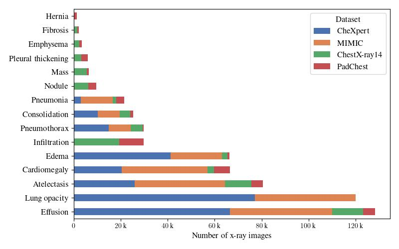
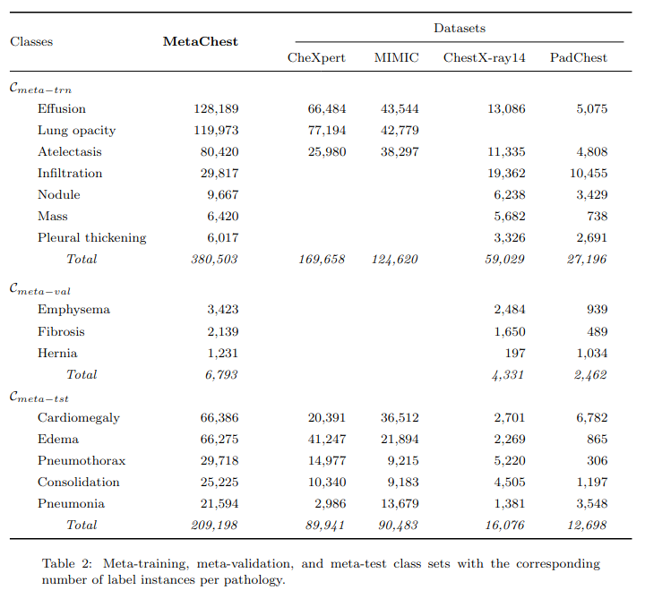

---
hide:
  - navigation
---

#



## Overview

[Metachest](https://github.com/bereml/metachest) is publicly available dataset patology classification on chest radiographs generated from ChestX-ray14, CheXpert, MIMIC-CXR-JPG and PadChest datasets.



A detailed explanation of the collection procedure and statistics can be found in the paper [MetaChest: Generalized few-shot learning of patologies from chest X-rays]().


## Data

The code to generate the dataset is available at its [repository](https://github.com/bereml/metachest).


## License
[Creative Commons Attribution Non Commercial Share Alike 4.0 International CC BY-NC-SA](https://creativecommons.org/licenses/by-nc-sa/4.0/legalcode).


## Citing
If you find this work useful in your research, please consider citing.

```
@misc{montalvolezama2025metachestgeneralizedfewshotlearning,
title={MetaChest: Generalized few-shot learning of patologies from chest X-rays}, 
author={Berenice Montalvo-Lezama and Gibran Fuentes-Pineda},
year={2025},
eprint={2509.25590},
archivePrefix={arXiv},
primaryClass={cs.CV},
url={https://arxiv.org/abs/2509.25590}, 
}
```


## People

Please feel free to contact us if you have questions.

* [Berenice Montalvo Lezama](https://turing.iimas.unam.mx/~bereml/)
* [Gibran Fuentes Pineda](https://turing.iimas.unam.mx/~gibranfp/)
